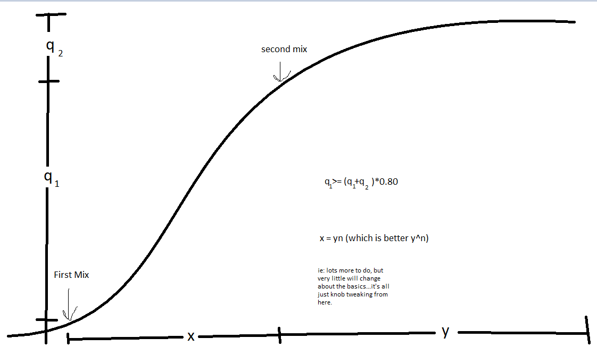

Have you ever known someone who tells you they are terrible at the guitar, then they pick it up at a party and play 20 dozen songs? In that moment, you can't really tell the difference between this individual and <a href="https://www.youtube.com/watch?v=2EQVDEulNJQ" rel="noopener noreferrer" target="_blank">Django Reinhardt</a>? It's like your definition of a guitarist and their's is somehow similar enough to translate conversationally, but the connotation of the word in each of you fails the denotation. This individual, currently halfway through Flagpole Sitta, has seen how deep the pool is and knows only enough to have a vague idea about how much they don't know. You, on the other hand, see them playing a guitar and feel confused by their bashful modesty.
On the other hand, if you knew a professional carpenter would you ask them over after work to help you build a cutting board in the workshop? My stepdad was a general contractor, and I was always confused as to why he never wanted to watch This Old House with me. I used to love reading and learning about modifying cars of all kinds (<a href="https://www.youtube.com/watch?v=WmjOZtuojC8" rel="noopener noreferrer" target="_blank">Ooh! Mini Trucker Magazine</a>). After working in the auto repair industry for several years, I still appreciate the ability to understand my ride a little better than the average motorist, but I'm by no means a mechanic. In fact, all I know is how hard of a job it is to be a good mechanic.

But there's a moment when learning is a wild ride. For a brief time, you don't know what you don't know, but that can't stop you. I believe that the learning curve is best visualized as a standard <a href="https://en.wikipedia.org/wiki/Logistic_function" rel="noopener noreferrer" target="_blank">logistic sigmoid function</a>. Although wikipedia had to tell me the name, I know this beast well. I think everything we learn lives on it. It's an ethos, it's a way of thinking. I've recently been working on recording a song with my two remote band mates. We've got the basic tracks lined up, but now I have to spend time iterating on it. I'm comfortable with that workflow and it's been getting better every day, but most of the work is done, so I made this graphic for them:

I find that part of the beauty of collaborative creation is in allowing oneself to go beyond one's normal boundary: to care too much, to push too hard, too many late nights, coffee ulcers, etc. The idea of performing without a net is only interesting if the crowd will to temporarily forgo that they know the net is there when the crowd is not. The world wasn't built by martyrs. They died.

### Phased learning

The curve above is the journey. I like to break it into three phases: the initial, the explosion, and the existential, but they also go by their trade names: the fun part, the scary part, the boring part. If money were no object I'd only ever spend time in the fun part. I call it the fun part, because it's where all the exciting new information comes from. This is when up becomes down, left becomes right...dogs and cats...living together...everything is chaotic, but it's chaotic because you're exchanging your incorrect assumptions for experiences. 
Our guitarist friend is hiding somewhere inside the explosion. It's the scary part because real decisions need to be made: how much time can I devote to this? Do I have any peers who are also involved? Can I add this to my to-do list? How deep does the well go? Do I need a degree? Are there jobs? Is there a future...holy shit. That's fast.
Because, at some point, you need to decide: am I a person who plays the guitar, or am I guitarist who pays the bills. You can be an admirable musician by spending the summer between junior and senior year playing guitar every day for 10 hours. No matter what you do, you'll have that with you, in some form or another.

### Get to the embarrassing part!

<iframe width="560" height="315" src="https://www.youtube.com/embed/L1dgF_fqDNo" frameborder="0" allow="accelerometer; autoplay; encrypted-media; gyroscope; picture-in-picture" allowfullscreen></iframe>

In the ever-long summer of my 20s, I made this music video. Man, it's cringey. I also recorded the song and helped rig the special effects. Several years prior to this, me and the boys here got our hands on a DVD of Spike Jonze music videos and thought: how hard could it be? Several years later, I came across a television show where grown adults would camp out in spooky houses with night vision cameras in order to live out some kind of Blair Witch fantasy. Hence, a VERY short time after hatching the idea for this video it was done, and we were happy with it. We couldn't be told that it was a bad idea because we wouldn't have had time to slow down to hear it. Most of our records worked the same way. We worked on them for many months, but most of the decisions were made instantaneously on gut instinct alone.

At some point, you need to 'fool yourself' into believing that you can't not do the thing. That failure is not an option. In my experience, that usually takes a lot of repetitions. That's a long dark night before the dawn breaks, and for some of us it never does. 

"I suck at it, so I quit."

I heard a dozen people say that about the boot camp I attended. Everyone else, in their own way, said, "I suck at it, so I guess I better keep trying." And while some of us feel that the only way to be successful is to never sink, always swim, mostly everyone I've respected has said that failing often is the quickest way to get good.

Of the many things I did with my band, most of them were awful. If left to our own devices, the members of my band would have each put out our own less-good albums and written our own less-interesting songs. In some cases, even the seven...then four...then three of us couldn't see the failure-trees in the failure-forrest. So videos and songs like this live on, forever reminding me to stay humble.

### BONUS: How To Have a Well Running Car
#### 1. Buy a Low mileage used car
New cars are not necessarily defect free. Used cars with lots of miles are likely to be in a further state of degradation than makes sense to maintain on an ongoing basis. If you have to buy a cheap high mileage car, be frank about repairing it. Sinking an extra 50% of the cost of a used car into repairs adds NOTHING to the value. The previous sale price will be the most you can get when you sell your car if the market allows. Repairs are a sunken cost. The best option, is to buy a used car with low mileage from a dealership or group that also sells new cars (bonus points if they also sell the make you're buying). New car dealerships make most of their money from service and used cars, so the moment a used car 'comes back' under warranty, it really hits the bottom line. There's a trope in the auto sales industry: The Old Lady Church Car. "She owned it for 12 years, kept it in a climate controlled garage and only drove it to church on Sundays". This is what you're looking for.
#### 2. You need more than one mechanic
The modern automobile is made up of a few mechanical systems, most of which are well understood by engineers, held together by a messy nest of wires and computers. In general, these computer systems use logic and feedback to make sure the literal explosions being harnessed by the drivetrain cause minimal harm to the user or others. Tellingly, a big part of the job of the computers inside a car is to control the environmental impacts of those explosions. While it's pretty easy to see why running over a person might cause them harm, it's harder to know that your decision to double your mileage between service intervals will needlessly harm the environment, both locally and globally. That's why you need two mechanics: a parts-changer and a technician.

The parts changer is just that: they change out the tires, the brakes, the motor mounts...anything mechanical where the viability can be perceived through manipulation. After fifty brake jobs, you know what a pulsing rotor feels like, you know what pad squeak sounds like, and you know when it's time to change caliper slides. After a year of practice, anyone can be this kind of mechanic.

The technician, on the other hand, is for the lights on your dashboard. This person charges you $150 to diagnose your problem, then another $100 an hour for labor afterwards. In 8 years of auto parts sales, I can easily say I've dealt with about 250 auto repair shops and dealerships. I've known thousands of techs. Of all of them, I can think of 4 off the top of my head who fit this profile. Many parts-changers will claim to be technicians, but the true technician is known by their spectacularly high rates, in comparison to their competition. A solo mechanic can feed their family with 30 to 50 regular customers. A great technician can reduce that number to 15 to 30. They can take a car that is halfway through it's useable life and keep it running optimally right up until it's time to move on. <a href="https://www.youtube.com/watch?v=JY7ISTaymU0" rel="noopener noreferrer" target="_blank">They will have a relationship with your car</a>. They will level with you and tell you when a repair isn't worth the cost, but to know that takes time.
#### C.A.F.E / D.O.T.
The automotive world is full of acronyms. They exist to make you feel far less like your car is an out of control explosion machine that is slowly trying to murder the planet and harm everyone within a blast radius. In fact your car is actually a highly controlled and regulated explosion machine that is slowly trying to murder the planet while protecting everyone within a blast radius from operator stupidity.

The auto industry and the transportation infrastructure in our country is a hand in glove operation. The cars we get access to are built with a million little details baked in, but because the highways and cars have just kind of always been there it's hard to connect the dots. Knowing that cars have fuel tanks within a certain range doesn't directly inform you that the distance between gas stations in this country is a highly thought out affair. The reality is, it should be hard to break your car or injure another person, and it is.

Back when I sold parts 'synthetic' oil was all the rage. Right off the top, synthetic oil is not what you think. The additives are synthetic. The base oil is still old liquefied dinosaur remains. When it first hit the scene, a handful of reports indicated that switching back and forth between synthetic and traditional oil could increase engine deposits. It seemed dubious to me, but at first, I let it go. But at the time my dad worked for ExxonMobile, specifically in the lubes division. While his purview was more industrial in nature, there was a small chance that an inquiry to the customer service number on the back of a quart of oil would wind its way to my dad's desk. 

So, one day after being rebuked by a mechanic for selling the wrong kind of oil, I  decided to call my dad and ask his opinion. Long story short, go ahead, switch up between regular and synthetic all you want because the fact that you're engine is not running in a lab implies that the engine deposits accumulated from mixing would be about as bad as environmental debris; which is to say insignificant, if the maintenance schedule is followed. I had access to an expert, but here's the first principles: ExxonMobil, a one time top 5 company in the world, wouldn't sell a product that would cause intentional harm to a properly maintained vehicle. If they did, they wouldn't be that big because they'd spend all their profit rebuilding mini-van motors. Additionally, the federal government wouldn't allow a company to sell a product that would drastically increase the risk of accidents, and faulty auto parts certainly fit inside that tent.

#### T.P.M.S.: The light to not ignore.
I'd just like to highlight one of my biggest pet-peeve auto repair issues: TPMS Sensors. No matter what your mechanic or pocketbook tells you, these things are life savers. Anyone old enough to have owned a car before they were main stream will tell you that tire pressure is very rarely checked, but having properly inflated tires impacts your fuel economy, handling / suspension, speed / acceleration, and braking performance.

#### M.I.L.: The light to ignore.
Of all the lights on your dash that are required to be there and operate in a certain way, the 'Check Engine Light' is more annoying to me. If your check engine light comes on and stays on solid, it means one thing only: Of the dozens of sensors which are collecting data to ensure that the emissions of the vehicle are within federal guidelines, one or more is currently reading out of spec. That could mean one of two things: the vehicles emissions have exceeded federal guidelines and the vehicle needs maintenance, or a component has failed (and the emissions are probably fine). These are two different things, but we lump them into one. Long story short, trust first principles when operating an automobile. The light is on, but the car is behaving normally? Get it to a mechanic, but not time to kill it with fire or have a break down. No light, but the car is doing something weird: Hitching/lurching, revving up without your input, slow/sluggish acceleration, weird noises? Take it off the road immediately. If the car is being weird and not alerting you, then it probably doesn't know it's hurting itself. I had a minivan that clunked when making hard left turns up a hill. Otherwise, it was perfect. Until the day that the CV axle (connected to the transmission) blew up in the middle of an intersection. Wanna know what the problem was? Motor mounts, obviously. Long story short, in the industry, dashboard lights are called 'idiot' lights for a reason. Don't need it.

### Make it easy for me:
1. Buy slightly used.
2. Pay mechanics to fix it.
3. Regular maintenance.
4. Ignore your intution. Refer to step 2.